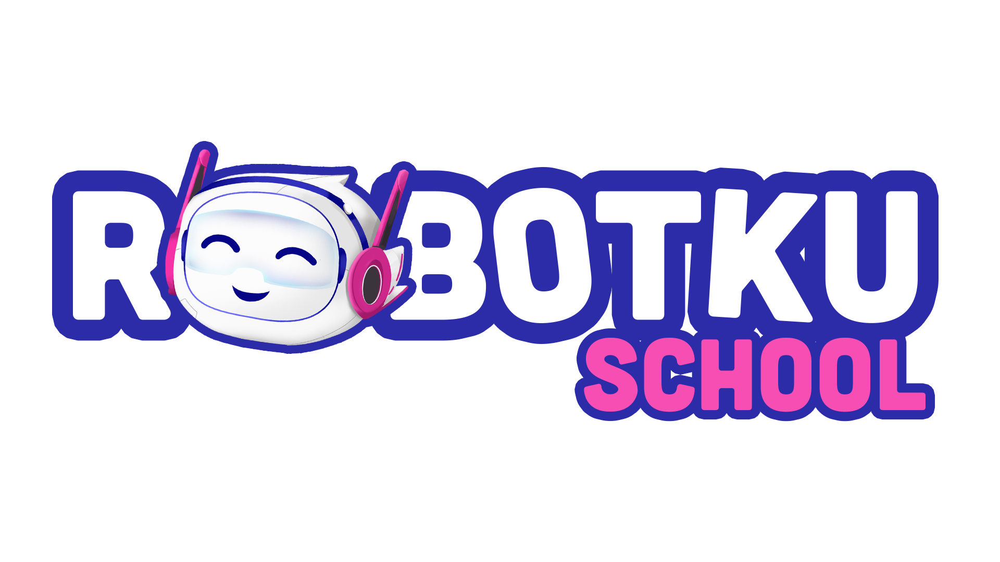

<div align="center">
  

# Robotku - Web Control & Block Coding Suite

**An intuitive, full-screen robotics control & scratch-style block coding platform built for Next.js, Blockly, and ESP32 robots.**

[](https://nextjs.org/)
[](https://www.typescriptlang.org/)
[](https://developers.google.com/blockly)
[](https://www.espressif.com/)

</div>

---

## 🌟 Overview

**Robotku** is a state-of-the-art Web Application designed to control and program educational robots in real time. Built according to the **Robotku Design System**, it combines high-performance full-screen control interfaces with a high-fidelity Scratch-style (Zelos) Block Coding environment, complete with an embedded 3D Three.js simulator and real-time ESP32 hardware communication.

---

## ✨ Key Features

### 🎮 1. Interactive Full-Screen Control Modes

- **Base Robot**: Direct D-pad directional drive with claw grabber/release triggers.
- **Port Control**: Precision testing for 8 motor/servo ports with individual sliders (`-100` to `+100`).
- **Tank Mode**: Dual left/right tread throttle controls with turret rotation support.
- **Joystick Mode**: Smooth 360° analog stick mixing with hardware action buttons.

### 🧩 2. Zelos Block Coding System

- **12 Comprehensive Categories**:
  - 🟢 **Movement**: Timed drive, steering, claw controls, emergency stop.
  - 🟠 **Timing**: Program execution wait & conditional wait blocks.
  - 🔵 **Display**: 5x5 LED Matrix patterns, LCD shapes, custom text strings.
  - 🟧 **Audio**: Tone generators, sound effects, slot recording & BPM controls.
  - 🟣 **Sensors & Data**: Touch buttons, ultrasonic, temperature, humidity, light, heading, & pin I/O.
  - 🩵 **Program Flow**: Loop repeat, infinite loops, while guards, if/else conditions.
  - 🧪 **Logic, Math, Variables, Functions, Templates, & AI**: Complete programming abstractions.
- **Glassmorphic Category Flyout**: Dynamic low-saturation glass pane transparency matching each active category color (`backdrop-filter: blur(16px)`).
- **Isolated Category Filtering**: Selecting a category opens only its corresponding blocks, preventing scroll bleeding across sections.
- **Robotku Design System Typography**: Styled with **Plus Jakarta Sans** Display 30px / 800 Bold sidebar headers and H1 23px / 700 Bold flyout headers.

### 🤖 3. Embedded 3D Simulator & Real-Time Hardware Bridge

- **Three.js 3D Robot Canvas**: Live 3D robot model animating program execution in real time right under the glass pane layout.
- **ESP32 Serial & Telemetry Bridge**: Seamless WebSerial/WebSocket connectivity to stream generated JSON opcodes directly to ESP32 hardware.

---

## 🛠️ Technology Stack

| Component                 | Technology                                                                                                  |
| :------------------------ | :---------------------------------------------------------------------------------------------------------- |
| **Framework**             | [Next.js 15](https://nextjs.org/) (Pages Router)                                                            |
| **Language**              | [TypeScript](https://www.typescriptlang.org/)                                                               |
| **Block Coding Engine**   | [Google Blockly](https://developers.google.com/blockly) (Zelos Renderer)                                    |
| **3D Rendering**          | [Three.js](https://threejs.org/)                                                                            |
| **Design Tokens & Icons** | Vanilla CSS Modules, [Plus Jakarta Sans](https://fonts.google.com/specimen/Plus+Jakarta+Sans), Lucide Icons |
| **Hardware Firmware**     | C++ / Arduino ESP32 (`firmware/robotku-esp32/`)                                                             |

---

## 🚀 Getting Started

### Prerequisites

- **Node.js**: v18.0.0 or higher
- **npm**: v9.0.0 or higher

### Installation

1. **Clone the repository**:

   ```bash
   git clone git@github.com:sudo-kachponz/robotku.git
   cd robotku
   ```

2. **Install dependencies**:

   ```bash
   npm install
   ```

3. **Run the development server**:

   ```bash
   npm run dev
   ```

   Open [http://localhost:3000](http://localhost:3000) in your browser to view the application.

4. **Build for production**:
   ```bash
   npm run build
   npm run start
   ```

---

## 🔌 Firmware Setup (ESP32)

The firmware source code is located in `firmware/robotku-esp32/robotku-esp32.ino`.

1. Open `firmware/robotku-esp32/robotku-esp32.ino` in **Arduino IDE** or **PlatformIO**.
2. Install required ESP32 board support and libraries (ArduinoJson, WebSockets).
3. Connect your ESP32 board via USB.
4. Select board **ESP32 Dev Module** and upload.

---

## 📁 Repository Structure

```
robotku/
├── public/
│   └── brand/               # Brand assets & mascot logos
├── src/
│   ├── assets/              # SVGs, icons, and UI graphics
│   ├── categories/          # 12 Blockly category definitions & generators
│   ├── components/
│   │   ├── blockcoding/     # Block coding editor & glass pane canvas
│   │   ├── control/         # Control layout & connection status bar
│   │   └── modes/           # Interactive mode components (Joystick, Tank, etc.)
│   ├── pages/               # Next.js pages & control routing
│   ├── styles/              # Design System tokens & module styles
│   ├── simulator.ts         # Three.js 3D robot simulator engine
│   ├── toolbox.ts           # Blockly category toolbox structure
│   └── visual/              # Robotku theme, palette, and category icons
└── firmware/
    └── robotku-esp32/       # ESP32 Arduino C++ firmware
```

---

## 📄 License

This project is open source and available under the [MIT License](LICENSE).
